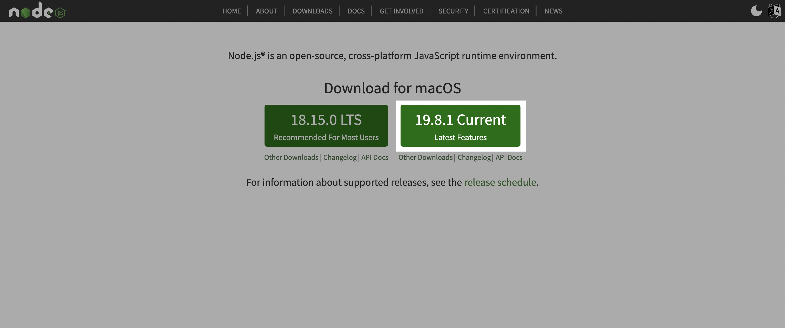
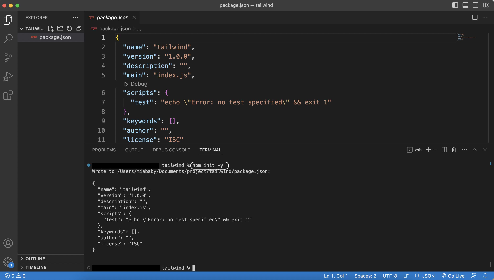
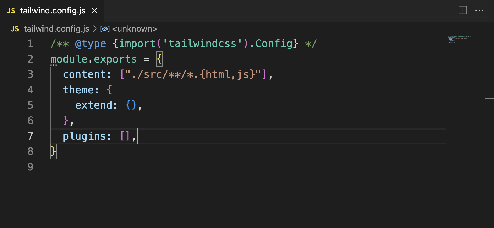
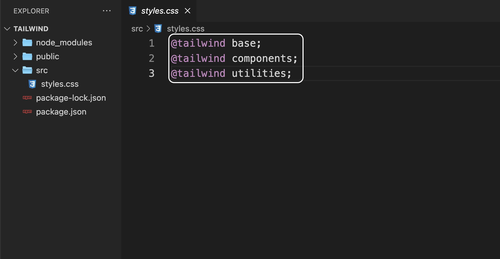
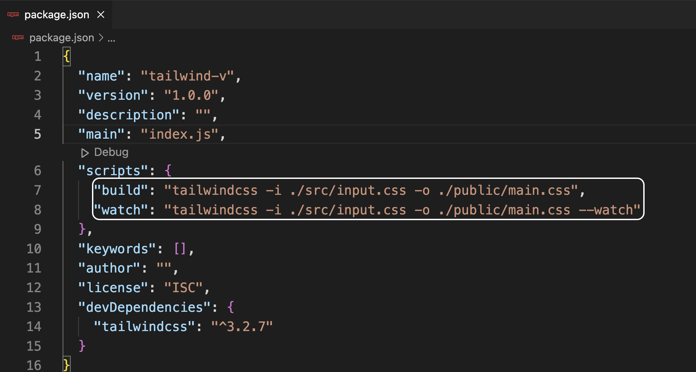

## Install Tailwind CSS
最简单的方法是用`npm`安装Tailwind CSS。
1. 如果没有安装Node.js，则先到Node.js的[官网](https://nodejs.org/en) 安装Node.js。
    
2. 在终端输入`node -v`命令检查Node.js是否安装成功，若出现Node.js的版本号，则代表安装成功。
    ```bash
    node -v
    ```
3. 用VS Code打开项目文件夹，再打开VS Code的终端，用`npm`命令创建一个`package.json`，我们将用这个json文件来追踪所有用`npm`安装的依赖（dependancy）。
    ```bash
    npm init -y
    ```
    
4. 为项目安装Tailwind
    ```bash
    npm install -D tailwindcss
    ```
    安装完成后，项目中会多出一个`node_module`文件夹和一个`package-lock.json`文件。
5. 创建`tailwind.config.js`文件
    ```bash
    npx tailwindcss init
    ```
6. 在`tailwind.config.js`中添加内容文件路径：
    ```bash
    ./src/**/*.{html,js}
    ```
    

## Set up Tailwind CSS
1. 手动创建`src`文件夹和`public`文件夹
2. 在`src`文件夹中创建`input.css`文件，并在该文件头部写入引用Tailwind的代码：
    ```CSS
    @tailwind base;
    @tailwind components;
    @tailwind utilities;
    ```
    
3. 打开`package.json`文件，找到`"scripts":`部分，删除原来的code，输入：
    ```
    "build": "tailwindcss -i ./src/input.css -o ./public/main.css",
    "watch": "tailwindcss -i ./src/input.css -o ./public/main.css --watch"
    ```
    
4. 运行一次`build-css`脚本，在VS Code的终端中输入命令：
    ```bash
    npm run build
    ```
    这会在`public`文件夹下自动生成`main.css`文件。

## Use Tailwind CSS in HTML
1. 在`src`文件夹下创建`index.html`，并在`index.html`的`<head></head>`中加入：
    ```HTML
    <link rel="stylesheet" href="public/main.css">
    ```
2. 接下来可以试用Tailwind的一些`class`，比如：
    ```HTML
    <h1 class="text-3xl">Hello World</h1>
    ```
3. 再用live server查看页面前，在VS Code的终端运行命令：
    ```bash
    npm run watch
    ```
4. 接下来就可以在Live Server中实时的看到页面中更改的变化了。

## Reference
- [Get started with Tailwind CSS](https://tailwindcss.com/docs/installation)
- [Tailwind CSS Tutorial - Intro & Setup](https://youtu.be/bxmDnn7lrnk)
- [Tailwind Crash Course | Project From Scratch](https://youtu.be/dFgzHOX84xQ)